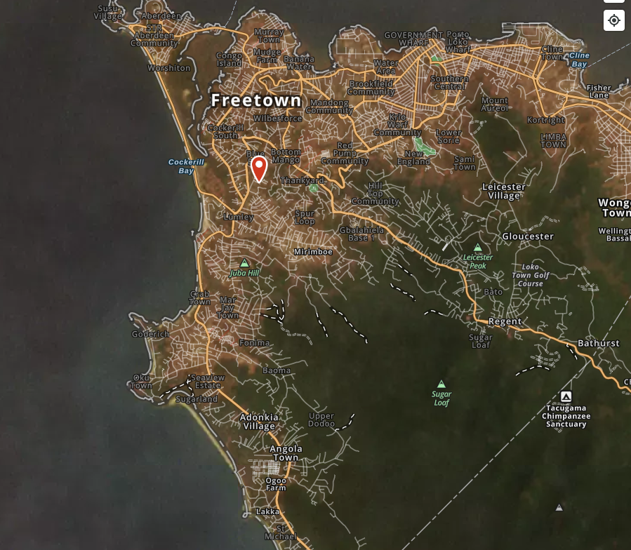

```{r setup, include=FALSE}
knitr::opts_chunk$set(echo = FALSE)
```



Distill is a publication format for scientific and technical writing, native to the web.


Learn more about using Distill at <https://rstudio.github.io/distill>.


